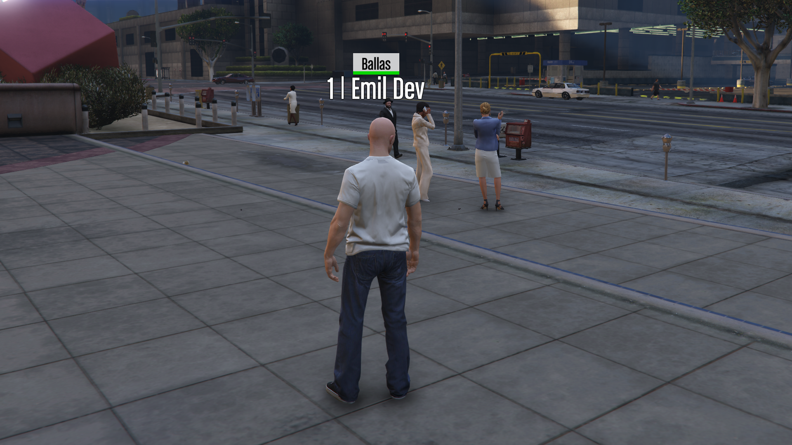

# emfan-nametag Script

## Description
The `emfan-nametag` script provides a customizable nametag feature for players in FiveM. It allows server administrators to manage and display player names effectively, enhancing player interaction and identification within the game.

## Features
- Display player names and crew tags above their characters.
- Toggle nametag visibility with a simple command.
- Customizable settings via the `config.lua` file.

## Installation
1. **Download and Extract**: Place the `emfan-nametag` folder into your server's `resources` directory.
2. **Configure Server**: Add `start emfan-nametag` to your server configuration file (`server.cfg`).
3. **Dependencies**: Ensure that you have the required dependencies installed, such as `oxmysql` and `emfan-framework`.

## Configuration
- Open the `config.lua` file to customize the command used to toggle nametags and database settings.

## Usage
- Use the in-game command specified in `config.lua` (default is `/showtags`) to toggle nametags for players.

## Support
For support, please contact eMILSOMFAN by opening a ticket in his discord (https://discord.gg/WycSqcDUt3). Contributions and feedback are welcome to improve the script further.
